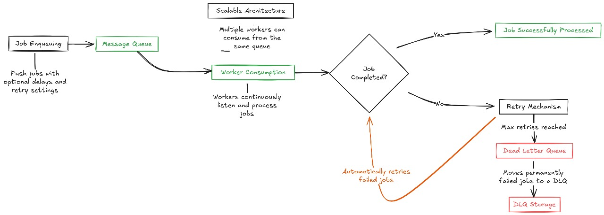

<div align="center">

  

  <h1 style="margin-top: 10px;">MQOx</h1>
  <p><strong>Message Queuing & Background Job Processing System</strong></p>

  <!-- Badges -->
  <p>
    
    
    
  </p>

</div>

MQOx is a lightweight, flexible message queuing system powered by Redis. It supports delayed jobs, retries, worker processing, and features a Dead Letter Queue (DLQ) for robust fault tolerance.

---

> #### ✅ **Update: Pub/Sub with QoS Level 1 (Guaranteed Delivery) is now supported!**

---

## Supported Models

| Model       | QoS Level | Persistence | Delivery Guarantee          | Ideal For                               |
| ----------- | --------- | ----------- | --------------------------- | --------------------------------------- |
| Queue       | QoS 1     | ✅ Yes      | Guaranteed (with DLQ)       | Background jobs, task runners           |
| Pub/Sub     | QoS 0     | ❌ No       | Best effort (fire & forget) | Real-time notifications                 |
| **Pub/Sub** | **QoS 1** | ✅ Yes      | **At-Least-Once Delivery**  | Financial transactions, critical events |

## **Overview**

A **message queue** is a system that lets applications handle tasks **asynchronously** - meaning jobs are added to a queue and processed later by background workers instead of immediately. This keeps your app fast, scalable, and fault-tolerant.

**MQOx** uses Redis to manage these queues efficiently.
It lets you:

- Enqueue jobs
- Process them using workers
- Automatically move failed jobs to a **Dead Letter Queue (DLQ)**

MQOx helps you build reliable background job systems for tasks like sending emails, generating reports, or handling any heavy processing all without blocking your main application.

---

  

---

## 📁 **Project Structure**

```
MQOx
│
├── src
│   ├── demo
│   │   ├── demoJobEmployee.ts       # Example worker to process jobs
│   │   └── demoJobProducer.ts       # Example producer to enqueue jobs
│   │
│   ├── types
│   │   ├── employee.type.ts
│   │   ├── enqueue.type.ts
│   │   └── job.type.ts
│   │
│   ├── employee.ts                  # Worker implementation
│   ├── queue.ts                     # Queue producer implementation
│   ├── redisClient.ts              # Redis connection helper
│   └── index.ts                    # Library entry point
│
├── .env                             # Redis configuration
├── package.json
├── tsconfig.json
└── README.md
```

---

## Features

| Feature               | Description                                       |
| --------------------- | ------------------------------------------------- |
| Job Enqueuing         | Push jobs with optional delays and retry settings |
| Worker Consumption    | Workers continuously listen and process jobs      |
| Retry Mechanism       | Automatically retries failed jobs                 |
| Dead Letter Queue     | Moves permanently failed jobs to a DLQ            |
| Scalable Architecture | Multiple workers can consume from the same queue  |

---

## Installation & Setup

### 1️⃣ Clone the Repository

```bash
git clone https://github.com/your-repo/MQOx.git
cd MQOx
```

### 2️⃣ Install Dependencies

```bash
npm install
```

### 3️⃣ Setup Environment Variables

Create a `.env` file in the project root:

```env
REDIS_URL=redis://localhost:6379
```

> Make sure Redis is running locally or update the URL accordingly.

### 4️⃣ Build the Project

```bash
npm run build
```

---

## Running the Demo

### **Step 1: Start the Worker**

This will start listening for jobs and processing them.

```bash
npm run demo:employee
```

### **Step 2: Run the Producer to Add Jobs**

In a new terminal:

```bash
npm run demo:producer
```

### ✅ Expected Output

- Jobs will be added to the queue.
- Worker consumes them.
- If a job fails and retry attempts are exhausted, it's moved to the **Dead Letter Queue**.

---

## How MQOx Works (Flow)

```
┌────────────────┐
│  Producer      │
│ (enqueue job)  │
└───────┬────────┘
        ▼
┌───────────────────────┐
│ Redis Queue (FIFO)    │
└───────┬───────────────┘
        ▼
┌───────────────────────┐
│ Employee (Worker)     │
│ Processes the Job     │
└───────┬───────┬───────┘
        │Success│Failure
        │       ▼
        │   RetryCount > 0?
        │         │
        │         ├─ YES → Requeue
        │         └─ NO → Dead Letter Queue
        ▼
┌───────────────────────┐
│Dead Letter Queue (DLQ)│
└───────────────────────┘
```

---

## 🧪 Commands Overview

| Command                 | Description          |
| ----------------------- | -------------------- |
| `npm install`           | Install dependencies |
| `npm run build`         | Compile TypeScript   |
| `npm run demo:employee` | Run worker demo      |
| `npm run demo:producer` | Run producer demo    |

You can define these scripts in your `package.json` like:

```json
"scripts": {
  "build": "tsc",
  "start": "node dist/index.js",
  "demo:employee": "ts-node src/demo/demoJobEmployee.ts",
  "demo:producer": "ts-node src/demo/demoJobProducer.ts"
}
```

---

## Viewing Dead Letter Queue

To inspect failed jobs:

```ts
const deadJobs = await redisClient.lRange("emailQueue:DLQ", 0, -1);
console.log(deadJobs);
```

---

## Roadmap

- 🔜 Publish/Subscribe
- 🔜 Priority Queue
- 🔜 Scheduled (Cron) Jobs
- 🔜 REST API for Monitoring
- 🔜 Web Dashboard

---

## 🙌 Contribution

Pull requests and feature suggestions are welcome!

> ⭐ If this project is useful to you, please give it a star to show your support!

---
